<!-- ~~~ hand-crafted with 🌴 and zero JS: the palms sway, the waves drift, and a shooting star crosses every 9s ~~~ -->

  

  

  
  

---

### 🌊 about

> front-end dev sailing toward full-stack — currently obsessed with making the web **fast, cached and type-safe**. if it can't run on `bun`, i'm suspicious of it. 🥥

### 🧰 the toolbox

  

### 🏝️ currently

| | |
|---|---|
| 🔨 | building great stuff — more shipping soon 👀 |
| 📚 | deep-diving the TanStack ecosystem — Router, Query, Table, Start |
| 🧭 | exploring the coastline between SPA comfort and SSR superpowers |
| 🌅 | best code written during golden hour |

  
   
  <em>mahalo for surfing by — see you on the next wave 🤙</em>

  
🥚 psst… something moved in the banner

   
  you found the secret shell 🐚
    
  this whole profile is <b>zero JavaScript</b> — just markdown and one hand-drawn SVG.
  the palms sway on a 7s loop, the waves drift on 9s and 6.5s,
  the sun's reflection shimmers… and yes, a shooting star crosses the sky every 9 seconds.
  curiosity rewarded. 🌴

